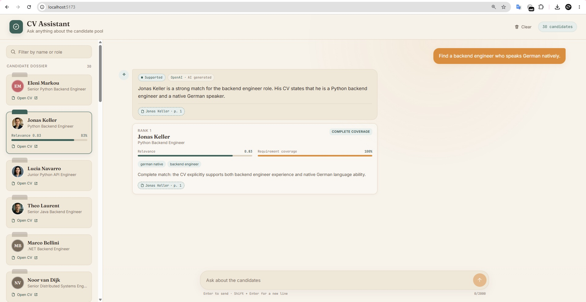

# AI CV Screener

A local, source-grounded candidate search product built with FastAPI, React,
PyMuPDF, Sentence Transformers, ChromaDB, and direct hosted LLM providers with
a deterministic no-key fallback.

[Quick start](#quick-local-setup) · [Application preview](#application-preview) · [Product flow](#product-flow)

## Quick local setup

1. Install Docker Desktop (Windows/macOS) or Docker Engine with the Compose
   plugin (Linux).
2. Clone this repository and open a terminal in the project directory.
3. Run the interactive configuration assistant for your platform.

   **Windows PowerShell**

   ```powershell
   .\setup.ps1
   ```

   **Linux or macOS**

   ```bash
   bash ./setup.sh
   ```

   The Bash script can also be made directly executable:

   ```bash
   chmod +x setup.sh
   ./setup.sh
   ```

4. Choose Gemini, OpenAI, or deterministic no-key mode.
5. Start the containers in the background:

   ```bash
   docker compose up -d --build
   ```

6. Build the local CV search index from the committed PDF collection:

   ```bash
   docker compose exec backend python -m app.scripts.ingest_cv_documents --all --rebuild
   ```

7. Restart the backend so it opens the newly persisted Chroma index:

   ```bash
   docker compose restart backend
   ```

8. Open:

   - React application: `http://localhost:5173`
   - FastAPI documentation: `http://localhost:8000/docs`
   - API health: `http://localhost:8000/api/health`

Both setup assistants preserve unrelated `.env` settings, clear unused provider
keys, and never print the entered secret. No Python or TypeScript source file
needs to be edited for local setup.

The Chroma index is a generated local artifact and is not committed to Git. The
index command is therefore required once after cloning, and again only when the
CV PDFs, extraction, chunking, embedding model, or indexing configuration changes.
The first run may download the local sentence-transformer embedding model.

## Application preview



The interface combines the 30-candidate catalogue with grounded answers,
candidate-level relevance and requirement coverage, and source-linked CV
evidence in one local recruiter workflow.

## Product flow

```text
Question
-> semantic recall
-> relation-aware exact evidence
-> candidate-level ranking
-> support classification
-> bounded context
-> grounded answer generation
-> validated candidate-owned citations
-> React evidence and CV-page presentation
```

The UI loads the real indexed candidate catalogue, sends grounded chat
requests, distinguishes supported, partial, and unsupported results, highlights
ranked candidates, and opens citation evidence down to the PDF file and page.

## Answer-provider modes

- **Gemini:** Uses `GEMINI_API_KEY` and the configured Gemini model.
- **OpenAI:** Uses `OPENAI_API_KEY` and the configured OpenAI model.
- **Deterministic:** Requires no API key and returns concise grounded answers
  directly from the validated retrieval result.
- **Auto:** Prefers Gemini when a Google key exists, then OpenAI, then the
  deterministic fallback.

Secrets are stored only in the local root `.env` file. That file is ignored by
Git. Provider keys are never exposed through the API or through `VITE_`
variables, because Vite variables are public browser configuration.

## Application API

```text
GET  /api/health
GET  /api/candidates
POST /api/chat
GET  /api/candidates/{candidate_id}/cv
```

The API returns safe validation/error envelopes and serves candidate PDFs only
through trusted indexed metadata.

## Troubleshooting

### `The CV index is not available`

The backend is running, but the persisted Chroma collection has not been built
or mounted. Rebuild it from the committed CV PDFs, then restart the backend:

```bash
docker compose exec backend python -m app.scripts.ingest_cv_documents --all --rebuild
docker compose restart backend
```

Optionally inspect the resulting vector store:

```bash
docker compose exec backend python -m app.scripts.inspect_cv_vector_store
```

This indexing step is different from regenerating the synthetic candidate
dataset. Reviewers can use the committed CV PDFs and do not need an OpenAI key
to rebuild the local vector index.

## Validation

Backend:

```powershell
docker compose run --rm backend pytest -q
```

Frontend:

```powershell
docker compose run --rm frontend npm run lint
docker compose run --rm frontend npm run test
docker compose run --rm frontend npm run build
```

The synthetic CV-generation utilities still require OpenAI when a developer
chooses to regenerate the dataset. Normal question answering does not require
dataset regeneration, but a fresh clone must build the local Chroma index once
from the committed CV PDFs as shown in the quick start.

## Query robustness diagnostic

The controlled corpus includes a separate 50-question diagnostic matrix across
13 paraphrase families. It is intentionally provider-free: the command runs the
existing retrieval pipeline, records whether a hosted answer provider would have
been called, and never sends a request to OpenAI or Gemini.

Run the complete baseline matrix:

```powershell
docker compose exec backend python -m app.scripts.evaluate_cv_query_robustness `
    --json-output data/cv_query_robustness_baseline.json
```

Inspect only failures with full parser and candidate-coverage details:

```powershell
docker compose exec backend python -m app.scripts.evaluate_cv_query_robustness `
    --failed-only `
    --verbose
```

Use `--strict` when the matrix should act as a regression gate. Without that
flag, baseline mismatches are reported but the command exits successfully so a
known failing baseline can be captured before a query-understanding refactor.

The report exposes:

- normalized lexical terms, phrases, relations, and numeric constraints;
- the hard candidate-level conditions created from the question;
- lexical terms discarded or left without a condition;
- pre-threshold candidate scores and condition coverage;
- final supported, partial, or unsupported behavior;
- expected and returned candidate IDs under exact, subset, or empty policies;
- paraphrase-family outcome and candidate-set consistency;
- whether the hosted answer provider would be called.

The matrix is an evaluation oracle for the committed synthetic corpus only. It
does not become an answer source; user-visible evidence continues to come from
the rendered and indexed CV PDFs.

## Query-understanding safeguards

Recruiter questions are normalized into evidence concepts before candidate
coverage is calculated. Conversational wording such as `knows`, `skilled in`,
`related to`, `uses`, `compare`, and `between` is preserved in the original
question for semantic recall but is not promoted into a fact that must appear
literally in a CV.

The deterministic query layer now models reusable relations for:

- degree level plus field of study, including BSc/BS/full-form aliases;
- professional-experience duration and comparison operators such as `6+`;
- language plus proficiency, including `native language` and `mother tongue`;
- candidate-owned role evidence with engineer/developer/development aliases;
- named-candidate comparisons without comparison verbs becoming skills;
- morphological capability aliases with stronger source requirements.

Run the robustness matrix as a strict regression gate after retrieval changes:

```powershell
docker compose exec backend python -m app.scripts.evaluate_cv_query_robustness `
    --strict `
    --json-output data/cv_query_robustness_after_refactor.json
```

The expected result is 50/50 scenarios passing with zero hosted-provider calls.
## Documentation

- [Technical highlight: grounded hybrid retrieval with relation-aware candidate evidence](docs/technical-highlight.md)
- [Known limitation and future enhancement: hybrid natural-language query planning](docs/known-limitations-and-future-enhancements.md)
