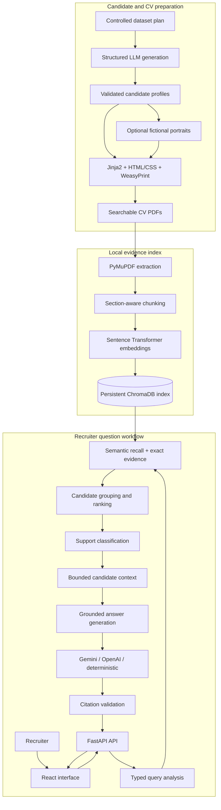

# AI CV Screener

A local, source-grounded candidate search application built with FastAPI,
React, PyMuPDF, Sentence Transformers, ChromaDB, and direct Gemini/OpenAI
integrations with a deterministic no-key fallback.

The project generates a controlled fictional CV collection, renders searchable
PDFs, indexes candidate-owned evidence, and answers recruiter questions with
validated source citations.

## Main capabilities

- 30 controlled fictional candidates with varied roles, skills, education,
  languages, seniority, and experience.
- Structured LLM profile generation with deterministic validation.
- HTML/CSS CV rendering through Jinja2 and WeasyPrint.
- Local `all-MiniLM-L6-v2` embeddings and persistent ChromaDB storage.
- Candidate-aware hybrid retrieval instead of raw nearest-neighbour chunks.
- Relation-aware evidence for numbers, roles, education, and languages.
- Supported, partial, and unsupported outcomes before answer generation.
- Grounded answers with candidate-owned PDF and page citations.
- Gemini, OpenAI, automatic selection, or deterministic no-key mode.
- Provider-free retrieval regression across 50 scenarios.
- Cross-platform Docker setup for Windows, Linux, and macOS.

## Architecture

The repository contains a preparation pipeline and a runtime question-answering
pipeline.



Runtime flow:

```text
Question
-> typed query analysis
-> semantic recall
-> relation-aware exact evidence
-> candidate-level ranking
-> support classification
-> bounded context
-> grounded answer generation
-> validated candidate-owned citations
```

Embeddings retrieve broadly related text. Deterministic Python then verifies
that the evidence proves the requested relationship and belongs to the same
candidate.

## Quick start

### Prerequisites

Install Git and Docker:

- Docker Desktop on Windows or macOS
- Docker Engine with the Compose plugin on Linux

No local Python or Node.js installation is required for the Docker workflow.

### 1. Clone the repository

```bash
git clone <repository-url>
cd ai-cv-screener
```

### 2. Configure the answer provider

The root setup scripts are the platform-specific entry points. They delegate to
the shared implementations under `backend/`.

**Windows PowerShell**

```powershell
.\setup.ps1
```

**Linux or macOS**

```bash
bash ./setup.sh
```

The Bash script can also be made executable:

```bash
chmod +x setup.sh
./setup.sh
```

Choose Gemini, OpenAI, or deterministic no-key mode. The assistant creates or
updates the local `.env` file, preserves unrelated settings, clears unused
provider keys, and reads secrets without printing them.

The `.env` file is ignored by Git and must not be committed.

### 3. Start the application

```bash
docker compose up --build -d
```

### 4. Build the local CV index

The Chroma index and embedding-model cache are local runtime artifacts. Build
the index from `data/cv_pdfs`:

```bash
docker compose exec backend python -m app.scripts.ingest_cv_documents --all --rebuild
docker compose restart backend
```

The first run may download the configured Sentence Transformer model.

### 5. Open the product

- React application: <http://localhost:5173>
- FastAPI documentation: <http://localhost:8000/docs>
- API health: <http://localhost:8000/api/health>

Stop the application with:

```bash
docker compose down
```

## Answer-provider modes

| Mode | Behaviour |
|---|---|
| Gemini | Uses `GEMINI_API_KEY` and the configured Gemini model |
| OpenAI | Uses `OPENAI_API_KEY` and the configured OpenAI model |
| Deterministic | Requires no key and formats validated retrieval locally |
| Auto | Prefers Gemini, then OpenAI, then deterministic mode |

Provider keys remain backend-only. They are never returned by the API and must
not be placed in a `VITE_` variable.

Candidate and portrait generation require OpenAI only when the controlled
dataset is intentionally regenerated. Normal question answering over the
existing PDFs does not require regeneration.

## Example questions

```text
Who has experience with Python?
Which candidate graduated from UPC?
Summarize the profile of Eleni Markou.
Who managed exactly eight engineers?
Find a backend engineer who speaks German natively.
Who holds a Bachelor of Science in Software Engineering?
Who knows Python, FastAPI, and PostgreSQL?
```

An unsupported example:

```text
Which candidates hold government security clearance?
```

When the indexed CV collection cannot support a claim, the API returns an
`unsupported` result without asking a hosted provider to invent an answer.

## Application API

| Method | Endpoint | Purpose |
|---|---|---|
| `GET` | `/api/health` | Provider and index readiness without exposing secrets |
| `GET` | `/api/candidates` | Indexed candidate catalogue |
| `POST` | `/api/chat` | Grounded candidate question answering |
| `GET` | `/api/candidates/{candidate_id}/cv` | Trusted inline PDF delivery |

Example:

```bash
curl -X POST http://localhost:8000/api/chat \
  -H "Content-Type: application/json" \
  -d '{"question":"Who managed exactly eight engineers?","candidate_limit":5}'
```

The response includes the support outcome, provider diagnostics, ranked
candidates, condition coverage, assessments, citations, source text, section,
page, and candidate CV URL.

## Retrieval quality

The retrieval layer:

1. embeds the recruiter question and retrieves a broad semantic pool;
2. extracts typed requirements such as roles, education, languages, numeric
   relations, and comparison operators;
3. recovers exact evidence through a bounded scan of persisted chunk text;
4. validates numbers and concepts inside local evidence contexts;
5. groups evidence by `candidate_id`;
6. ranks candidates by condition coverage, evidence quality, and semantic
   support;
7. returns supported, partial, or unsupported evidence before generation;
8. validates provider citations against the accepted candidate context.

This prevents related but incorrect evidence such as `8 years of experience`
from satisfying `managed exactly 8 engineers`.

## Testing

Backend:

```bash
docker compose run --rm backend pytest -q
```

Frontend:

```bash
docker compose run --rm frontend npm run lint
docker compose run --rm frontend npm run test
docker compose run --rm frontend npm run build
```

Provider-free retrieval regression:

```bash
docker compose exec backend python -m app.scripts.evaluate_cv_query_robustness --strict --json-output data/cv_query_robustness_after_refactor.json
```

Validated retrieval result:

```text
Families: 13
Scenarios: 50
Passed: 50
Failed: 0
Hosted provider calls made: 0
Result: PASS
```

## Useful maintenance commands

| Purpose | Command |
|---|---|
| Validate candidate profiles | `docker compose exec backend python -m app.scripts.validate_candidate_profiles` |
| Validate portraits | `docker compose exec backend python -m app.scripts.validate_candidate_portraits` |
| Render all CVs | `docker compose exec backend python -m app.scripts.render_candidate_cvs --all --enforce-portrait-plan` |
| Validate rendered CVs | `docker compose exec backend python -m app.scripts.validate_candidate_cvs` |
| Rebuild the index | `docker compose exec backend python -m app.scripts.ingest_cv_documents --all --rebuild` |
| Inspect index coverage | `docker compose exec backend python -m app.scripts.inspect_cv_vector_store` |

The scripts make each pipeline stage independently observable and repeatable.
When source artifacts change, only the affected stage and its downstream
artifacts need to be refreshed.

## Repository structure

```text
ai-cv-screener/
├── backend/
│   ├── app/
│   │   ├── api/                    # FastAPI routes and public schemas
│   │   ├── candidate_generation/   # Structured fictional profiles
│   │   ├── portrait_generation/    # Fictional portrait workflow
│   │   ├── cv_rendering/           # HTML/CSS and PDF rendering
│   │   ├── cv_ingestion/           # Extraction, chunks, embeddings, Chroma
│   │   ├── cv_retrieval/           # Query analysis and candidate ranking
│   │   ├── cv_answer_generation/   # Providers and grounded answers
│   │   ├── dataset/                # Controlled plans and evaluation matrix
│   │   └── scripts/                # Generation, validation, and inspection
│   └── tests/
├── frontend/
│   ├── public/candidate-images/
│   └── src/
│       ├── api/
│       ├── components/
│       ├── hooks/
│       └── test/
├── data/
│   ├── candidate_profiles/
│   ├── candidate_images/
│   ├── cv_html/
│   └── cv_pdfs/
├── storage/
│   ├── models/
│   └── chroma/
├── docs/
│   └── technical-highlight.md
├── compose.yaml
├── setup.ps1                       # Windows entry point
└── setup.sh                        # Linux/macOS entry point
```

## Technical highlight

The selected technical highlight is:

> **Grounded Hybrid Retrieval with Relation-Aware Candidate Evidence**

It documents the custom evidence layer between vector retrieval and answer
generation, including typed constraints, clause-local evidence validation,
candidate-level aggregation, support gating, and the provider-free robustness
matrix.

See [the complete technical highlight and video walkthrough](docs/technical-highlight.md).

## Scope

Included:

- controlled fictional CV generation;
- portrait and PDF rendering;
- local PDF ingestion and vector indexing;
- candidate-aware retrieval;
- grounded answer generation;
- FastAPI endpoints;
- React evidence presentation;
- automated and retrieval-quality tests.

Intentionally outside the assignment scope:

- authentication and user accounts;
- a production upload workflow;
- persistent chat history;
- administrative dashboards;
- production deployment and horizontal scaling.
